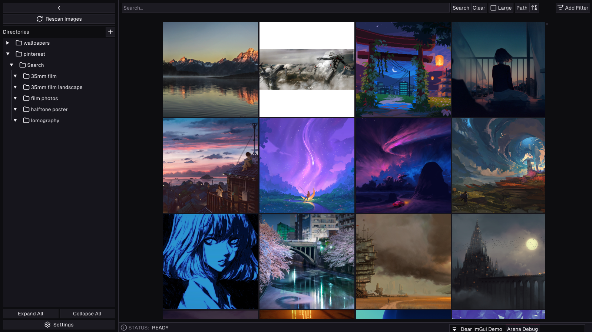
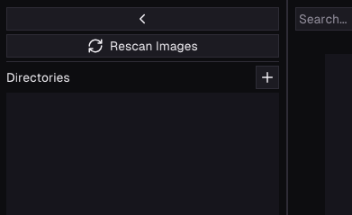
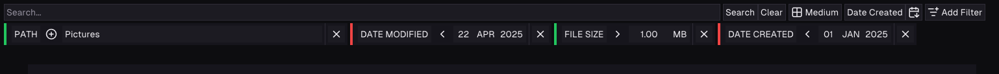

# Miscible

<p align="center">
    
</p>

**Miscible** is a next-generation, high-performance gallery application which brings on device semantic search and extensive filtering features to your local media. Built in C++, it delivers lightning-fast responsiveness and an incredibly light footprint all within a ~8MB binary. It brings the advanced features typically locked behind cloud-based commercial products like Google Photos, OneDrive, and Microsoft Photos to your local machine, completely offline and privacy-first.

<p align="center">
    
    <i>Miscible running on Windows 10</i>
</p>

### Why Miscible?
*I made this because nothing like this exists and I love taking pictures 📸*

> [!NOTE]
> **Development Status:** Miscible is currently in an active alpha stage, things are expected to fail/break. Make sure to report any findings on the [issues](https://github.com/mdhvg/miscible/issues) page.

## Development

Miscible only supports Windows and Linux because these are the only operating systems I have available, out of which Windows is the one I actively use to develop Miscible (for now), so **Linux build is currently broken and outdated**. *(contributions are welcome)*

### Requirements

- [git](https://git-scm.com/)
- [cmake](https://cmake.org)
- [python3](https://www.python.org/) ([uv](https://docs.astral.sh/uv/) preferred)

### Setup

- Recursively Clone the repo
```bash
git clone --recursive https://github.com/mdhvg/miscible
cd miscible
```

- Run the setup script
```bash
python3 ./scripts/setup.py
```

**OR**

```bash
uv run ./scripts/setup.py
```

### Build - Windows

Build script automatically detects installed compiler. Supported ones are [msvc](https://visualstudio.microsoft.com/vs/features/cplusplus) and [clang-cl](https://clang.llvm.org). `Miscible.exe` is built in `(project root)/build` directory.

```powershell
./scripts/build.ps1 [debug|release] [msvc|clang-cl]
```

### Build - Linux

_TODO_

## Usage

- From the first launch, Miscible will start downloading the [`laion/CLIP-ViT-B-32-laion2B-s34B-b79K`](https://huggingface.co/laion/CLIP-ViT-B-32-laion2B-s34B-b79K) automatically in the background.
- To get some images displaying in Miscible, click the ➕ button in the sidebar and select an and let it automatically scan the directories and populate the thumbnail previews.

<p align="center">
    
</p>

- Use the **Search/Sort/Add Filter** buttons according to requirements to view results with different constraints (inclusion or exclusion).

<p align="center">
    
</p>

- Press **Clear** button to go back to viewing all images again.

## Found bugs?

Create an [issue](https://github.com/mdhvg/miscible/issues) and paste in the logs relevant to that bug.

| Operating System | Log file location               |
| :--------------- | :------------------------------ |
| **Windows**      | `%LOCALAPPDATA%/Miscible/logs/` |
| **Linux**        | `~/.local/share/Miscible/logs/` |

## Credits

Although there are many things that need refactoring to follow the style (#TODO), the code style and build procedure in this software is heavily inspired by [@Casey Muratori's](https://caseymuratori.com/about) [Handmade Hero series](https://hero.handmade.network) ([YouTube](https://www.youtube.com/watch?v=Ee3EtYb8d1o)).

A lot of core code snippets come from [EpicGamesExt/raddebugger](https://github.com/EpicGamesExt/raddebugger).
### Other sources which were referenced

- `src/base/arena.*` from [Enter The Arena: Simplifying Memory Management (2023)](https://www.youtube.com/watch?v=TZ5a3gCCZYo) by [@Ryan Fleury](https://x.com/rfleury) and from [tsoding/arena](https://github.com/tsoding/arena) by [@tsoding](https://www.twitch.tv/tsoding).
- `src/base/string.*`, `src/base/array.h` from [Vjekoslav Krajačić – File Pilot: Inside the Engine – BSC 2025](https://youtube.com/watch?v=bUOOaXf9qIM) at [@BSC](https://www.youtube.com/@BetterSoftwareConference) 2025 talk by [@Vjekoslav Krajačić](https://x.com/vkrajacic).
